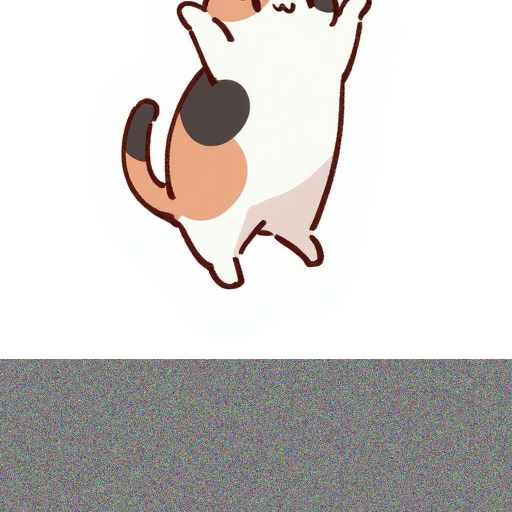

# image-noise-expander


## Installation
```bash
uv sync
```

## Usage
```bash
uv run app.py
```

## Results

| Input |
|:---------------:|
|  |

### Outside Mode

| TOP | BOTTOM | LEFT | RIGHT |
|:---------------:|:---------------:|:---------------:|:----------------:|
| |  |  |  |
| |  |  |  |

### Inside Mode

| TOP | BOTTOM | LEFT | RIGHT |
|:---------------:|:---------------:|:---------------:|:----------------:|
| |  |  |  |
| |  |  |  |
